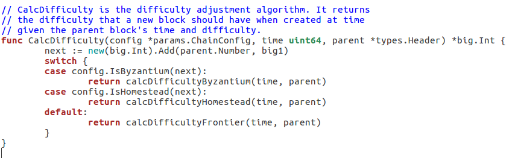
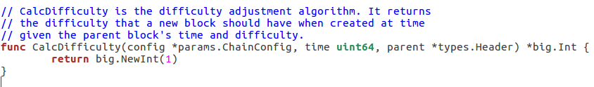
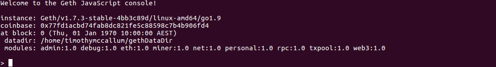
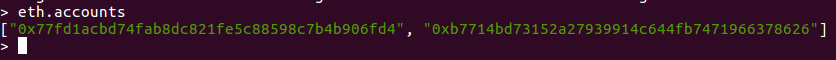
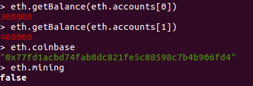
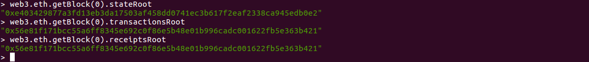

# The Ethereum world - how its data is stored

The aim of this post is to provide as much information, as possible, in relation to how Ethereum stores its transactions, contracts, account balances and more.

In this post we:
- begin with an overview of what blockchain "state" means
- provide an overview of the popular blockchain database software, leveldb
- introduce the Patricia Trie data structure which Ethereum uses exclusively
- learn how Ethereum implements the Patricia Trie data structure inside leveldb
- learn about Ethereum's leveldb structure
- provide a step by step guide on installing a test-bed for Ethereum and leveldb (using Ubuntu Linux 16.04LTS)
- provide justification for using an Ethereum private network for the test-bed (as apposed to the main-net or testnets)
- configure and run Ethereum on a private network
- configure Ethereum to mine on the private network
- execute transactions and smart contracts on the Ethereum private network
- explore Ethereum's application data storage layer, leveldb, before and after activity to discover how it works

# Blockchain "state"
Ethereum is a transaction-based "state" machine; a technology on which all transaction based state machine concepts may be built [1]. The Ethereum blockchain begins life with a genesis state. From the genesis block onward, activities such as transactions, contracts and mining continually change the state of the Ethereum blockchain. In Ethereum, an example of this would be an account balance (stored in the state trie) changing when a transaction, in relation to that account, takes place. 

The state is not stored in the blocks of the Ethereum blockchain. The blocks function as a journal; a record of transactions. One of the key features of the blockchain is immutability. Once blocks are mined they are never updated. It  makes sense then, that permanent data like mined transactions would be stored separately from data like ephemeral account balances. We will learn more about this when we cover Ethereum's data structure.

# Ethereum's blockchain databases

The main Ethereum clients use two different database software solutions to store their data. Ethereum's Rust client Parity uses rocksdb. Whereas Ethereum's Go, C++ and Python clients all use leveldb.

## Ethereum and rocksdb

Rocksdb is out of scope for this post. This will be covered at a later date. For now let's explore how 3 of the 4 major Ethereum clients utilise leveldb.

## Ethereum and leveldb

LevelDB is an open source Google key-value storage library which provides, amongst other things, forward and backward iterations over data, ordered mapping from string keys to string values, custom comparison functions and automatic compression. The data is automatically compressed using “Snappy” an open source Google compression/decompression library. Whilst Snappy does not aim for maximum compression, it aims for very high speeds. Leveldb is an important storage and retrieval mechanism which manages the state of the Ethereum network. As such, leveldb is a dependency for the most popular Ethereum clients (nodes) such as go-ethereum, cpp-ethereum and pyethereum.

So how does Ethereum utilise leveldb?

# The Trie (or Tree)
A trie (or tree) is a data structure. Ethereum exclusively uses the Patricia Trie for its storage and retrieval of data.
Whilst the implementation of the trie data structure can be done on disk (using database software such as leveldb) it is important to note that there is a difference between traversing a trie and simply looking at the flat key/value database.

As a general example, if we were wanting to traverse a trie for the word dog, we might start at the root node of the tree and find the first character of the hexadecimal representation of "d" for dog. The letter "d" has a hexadecimal representation of 64, and as such we would start at the index of  "6" and continue to follow the path downwards by progressing to index 4 in the next node and so on. In a general sense this is quite inefficient because we might find our path being extremely deep, when storing longer strings. To address this Ethereum specifically use a "Practical Algorithm To Retrieve Information Coded In Alphanumeric" (PATRICIA) Trie as apposed to say a radix trie. All of the merkle tries in Ethereum use a Merkle Patricia Trie.

## Merkle Patricia Trie

Every interaction between Ethereum and its database involves a deterministic hash. In other words every put, update and delete function performed on the trie is done so, using a deterministic cryptographic hash. Further, the cryptographic hash of the node is used as the unique pointer of each node in Ethereum's database. This of course works due to the fact that a deterministic hash (a one-way has like sha3) provides a consistent hash in relation to the data which was used to generate the hash. 

The use of hashing also provides cryptographic data integrity; any changes to the data, at any level, would change the root hash. This provides a fast data integrity mechanism.

In Ethereum, a single merkle Patricia trie node is either:
- an empty string (referred to as NULL)
- an array which contains 17 items (referred to as a branch)
- an array which contains 2 items (referred to as a leaf)
- an array which contains 2 items (referred to as an extension)

# Ethereum's database layout

## State trie - the one and only

There is one, and one only, global state trie in Ethereum. The state trie's root node can be used as a secure and unique identity for the entire state trie; the state trie's root node is cryptographically dependent on all internal state trie data.  A "value" in the global state trie is created by encoding the following account details of an Ethereum account (using the Recursive-Length Prefix encoding (RLP) method):
- nonce
- balance
- storageRoot
- codeHash

The global state trie is constantly updated.

## Storage trie - where the contract data lives

A storage trie is where all of the contract data lives. Each Ethereum account has its own storage trie.

## Transaction trie - one per block

Each Ethereum block has its own separate transaction trie. A block contains many transactions. The order of the transactions in a block are of course decided by the miner who assembles the block. The path to a specific transaction in the transaction trie, is via (the RLP encoding of) the index of where the transaction sits in the block. Mined blocks are never updated; the position of the transaction in a block is never changed. This means that once you locate a transaction in a block's transaction trie, you can return to the same path over and over to retrieve the same result.

# Installing Ethereum

We are going to install Ethereum on a private network, create accounts, perform transactions and then analyse the application data layer in order to improve our understand of how Ethereum works. We will be doing this on a Linux Ubuntu 16.04 LTS installation.

## Housekeeping

Type the following commands to update the system as best we can.

`
sudo apt-get update
`

`
sudo apt-get upgrade
`

`
sudo apt-get install -y build-essential
`

## Installing Go

To get the Go package type the following.

`
cd ~
`

`
wget https://dl.google.com/go/go1.9.2.linux-amd64.tar.gz
`

Then verify the download by checking that the sha256sum results from the following command match that of the relevant sha256 checksum section on the < https://golang.org/dl/ > website.

`
sha256sum go1.9.2.linux-amd64.tar.gz 
`

To unpack the package, type the following (using sudo).

`
sudo tar -C /usr/local -xzf go1.9.2.linux-amd64.tar.gz 
`

To ensure that the Go path is set for your user profile. Add the following line to the end of your ~/.profile file.

`
export PATH="$PATH:/usr/local/go/bin"
`

Log out and in (or reboot) to ensure the environment variables have taken.
Test Go with the following command (confirm the version).

`
go version
`

The output should show the version.

`
go version go1.9.2 linux/amd64
`

## Installing Git

`
sudo apt-get install git
`

## Fetching Geth

Change to home directory.

`
cd ~
`

Fetch the Geth software.

`
git clone https://github.com/ethereum/go-ethereum.git
`

### Mining difficulty

As this will be a private network, we do not want the Ethereum installation to constantly increase the difficulty setting. We are just performing some testing, in a closed and private network, and as such want the quickest mining time available.

To set the difficulty at 1 statically, we need to open the following file in the source code (before compiling).

`
go-ethereum/consensus/ethash/consensus.go
`

Once we have this file open for editing, we need to go to the calcDifficulty function (currently on line 298).

`
https://github.com/ethereum/go-ethereum/blob/02aeb3d76652a4c0451e5c3734e6881aefe46249/consensus/ethash/consensus.go#L298
`

This function controls which difficulty adjustment function is called. 

In order to guarantee the lowest difficulty level (on an ongoing basis), we will need to strip out the case statement and simply return big.NewInt(1) for the entire function's execution.

`
return big.NewInt(1)
`

**NOTE:** Additional configuration and commands are required in relation to accounts, networks and configuration. Please hold off running any commands until reading the next few paragraphs.

# Explaining Ethereum networks

## Main network

For peer-to-peer nodes to interact on the same network they have to have the identical protocol version and the right network ID. In order for peer nodes to connect to the main Ethereum network, nothing extra is required; simply starting the Ethereum software will suffice. From an experimental, testing perspective there are two main drawbacks to using the main Ethereum network. Firstly, of course starting Ethereum with the default network settings will result in your peer node downloading the entire Ethereum blockchain. This takes a significant amount of time and requires a lot of storage on your local disk. Secondly any activity on the main Ethereum network requires “gas”. Whilst this gas is obtainable, it involves purchasing and depositing ETH into your account. You may not want to do this just for experimental testing.

## Test network

There are other ways to start your Ethereum node. You may want to use an Ethereum test network like Ropsten as this will provide the flexibility to participate on the network without purchasing ETH. Testnet ETH can be obtained without having to pay real money. This solves one problem, however using a testnet like Ropsten also requires you to download the Ropsten testnet blockchain. This again, takes time and requires local disk space.

## Private network

One final alternative is to run a private network. A private network requires negligible local disk storage and can be operated without having to purchase ETH with real money. So what constitutes a private Ethereum network?

“An Ethereum network is a private network if the nodes are not connected to the main network nodes. In this context private only means reserved or isolated, rather than protected or secure.”[9]

As mentioned on the Ethereum GitHub page a private network is neither protected or secure. In addition, setting up a private network requires a little bit of extra configuration. You can alleviate the security aspect by simply running the private Ethereum network behind a properly configured firewall. With security aside, all that is left if to perform is the extra configuration.

# Running a private Ethereum network

The following paragraphs will help with configuring and running the Ethereum private network.

## Network ID

The network ID for the main Ethereum network is 1. If started in default mode, the code will automatically connect to the main Ethereum network by default.

Alternatively, the network ID can be passed into the command line when starting Go Ethereum code, using the following flag.
`
-- networkid
`

Obviously, in order to keep other nodes from connecting to your private Ethereum test network it would be in your best interests to a) secure the network using a properly configured firewall and b) choose a unique network ID

## Account

In a moment we will be using a once off mechanism to fund our account. Before we use that mechanism we need to create create a data directory for Ethereum, create our new accounts and save those account details for use on future steps. 
Create an Ethereum data directory by typing the following commands.

`
cd ~
`

`
mkdir gethDataDir
`

Then create a new account by typing the following command.

`
geth account new --datadir ~/gethDataDir
`

The output from the above command will produce a public account address (after you provide a password). Record and save this address for later use.

`
Your new account is locked with a password. Please give a password. Do not forget this password.
Passphrase: 
Repeat passphrase: 
Address: {77fd1acbd74fab8dc821fe5c88598c7b4b906fd4}
`

**It is recommended that you do this twice, that way you will have to addresses which you can send ETH back and forth to**

## Genesis block

When running Ethereum for the first time, if the default settings are used, the blockchain will start at the "hard coded" genesis block (first block in the public main net blockchain). From this point onward the code will find peers and synchronise until the Ethereum instance which you are running is up to date. Being synchronised, or up to date, means that you are storing everything from the genesis block, right up, to the most recent block, locally. Ethereum's blockchain is almost 45GB in size and so for our purpose of testing this is not desirable.

Instead, we can create our own genesis block. This must be done before starting Ethereum. 

## Create genesis.json

Create a file such as below, and save it with the name "genesis.json" into the ~/gethDataDir directory.

**Note** the "alloc" section where we paste in the two account addresses from above.
**Note** the "chainId" section which is set to 15 (and not 1). If you remember, above in the **Network ID** section, 1 is the main Ethereum network.

`
{
    "config": {
        "chainId": 15,
        "homesteadBlock": 0,
        "eip155Block": 0,
        "eip158Block": 0
    },
    "difficulty": "1",
    "gasLimit": "2100000",
    "alloc": {
        "77fd1acbd74fab8dc821fe5c88598c7b4b906fd4": { "balance": "300000" },
        "b7714bd73152a27939914c644fb7471966378626": { "balance": "400000" }
    }
}
`

## Initialize the blockchain 

Type the following initialisation command, which references the genesis and its settings.

`
geth --datadir ~/gethDataDir init genesis.json
`

## Starting Ethereum

Type the following command to start Ethereum. Please note that the networkid is the same as the "chainId" in the genesis.json file

`
geth --datadir ~/gethDataDir --networkid 15
`

## Starting the console

If we open a new terminal and type the following command, we can then use the Geth Javascript API to interact with Ethereum.

`
geth attach ipc:gethDataDir/geth.ipc 
`

## Using the console

The following command will list the Ethereum accounts which we recently created.

`
eth.accounts
`

The following commands will list details about your:
- account balances
- coinbase address (where the mining rewards are sent)
- mining status (true/false)

# Mining the Ethereum private network

To mine the Ethereum private network, simply type the following command. Please note the specific parameters which we provide such as datadir and networkid. These are to ensure the mining takes place on the correct blockchain/network.

`
geth --mine --minerthreads=1 --datadir ~/gethDataDir --networkid 15
`

# Transactions and smart contracts

Transactions and smart contracts soon.

# Analysing the Ethereum database

## Installing npm, node and level

We will be using nodejs and level to inspect the leveldb database.

With reference to the following site https://github.com/nodesource/distributions to install nodejs and npm please use the following commands.

`
curl -sL https://deb.nodesource.com/setup_9.x | sudo -E bash -
sudo apt-get install -y nodejs
`

`
sudo apt-get install nodejs
`

You can verify the versions by typing the following commands.

`
npm -v
`

For nodejs

`
nodejs -v
`

To install level, please use the following command.

`
npm install level
`

The nodejs console can be started by typing.

`
nodejs
`

To reference the level library into the console session type the following command.

`
var level = require('level')
`

The following command is use to set the database variable to the root directory of the Ethereum database

`
var db = level('/home/timothymccallum/gethDataDir/geth/chaindata')
`
We now have the ability to connect to and explore Ethereum's leveldb database.

# Web3
As we mentioned previously there are many Merkle Patricia Tries (referenced in **each** block) within the Ethereum blockchain:

- State Trie
- Storage Trie
- Transaction Trie
- Receipts Trie

To reference a particular Merlke Patricia Trie in a particular block we need to obtain its root hash, as a reference. The following commands are an example of how to obtain the root hashes of the state, transaction and receipt tries in the genesis block (block 0).

`
web3.eth.getBlock(0).stateRoot
`

`
web3.eth.getBlock(0).transactionsRoot
`

`
web3.eth.getBlock(0).receiptsRoot
`

For example

**Note:** If you would like the root hashes of the **latest** block (instead of the genesis block), please use the following command.

`
web3.eth.getBlock(web3.eth.blockNumber).stateRoot
`

# References
[1] Wood, G., 2014. Ethereum: A secure decentralised generalised transaction ledger. Ethereum Project Yellow Paper, 151.
