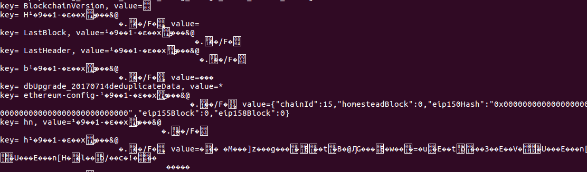

# draft notes put aside which may or not be useful in the long run

Please note, Ethereum must not be running when trying to access the database using nodejs. There will be a lock in place which will stop you from accessing the data.

The following code creates a read stream and allows us to retrieve all key/value pairs from the leveldb database

As we mentioned above Ethereum uses RLP to encode the values. This is evident in the output which we just received.

We are now going to provide node references and then traverse the paths of the **state** trie, **storage** trie and **transaction** trie in order to obtain the **state** data, **contract** data and **transaction** data respectively.

From this point, we can make changes to all of these areas and re-inspect the data.
